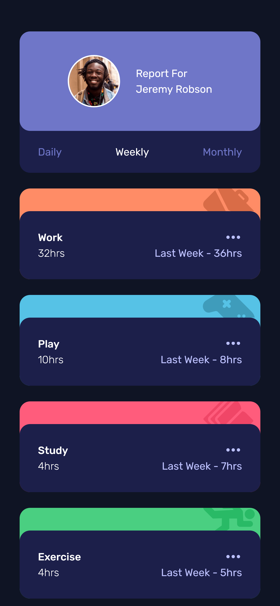
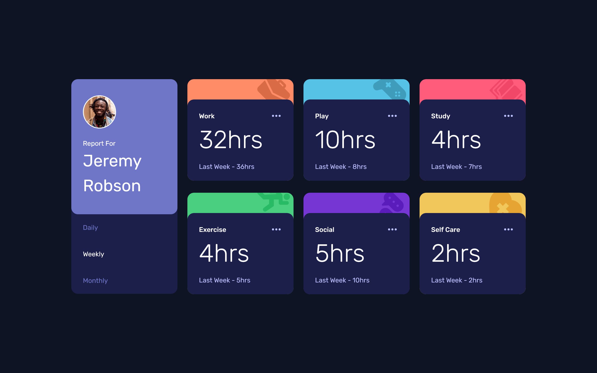

# Frontend Mentor - Time tracking dashboard solution

This is a solution to the [Time tracking dashboard challenge on Frontend Mentor](https://www.frontendmentor.io/challenges/time-tracking-dashboard-UIQ7167Jw). Frontend Mentor challenges help you improve your coding skills by building realistic projects. 

## Table of contents

- [Overview](#overview)
  - [The challenge](#the-challenge)
  - [Screenshot](#screenshot)
  - [Links](#links)
- [My process](#my-process)
  - [Built with](#built-with)
  - [What I learned](#what-i-learned)
  - [Continued development](#continued-development)
  - [Useful resources](#useful-resources)
- [Author](#author)

## Overview

### The challenge

Users should be able to:

- View the optimal layout for the site depending on their device's screen size
- See hover states for all interactive elements on the page
- Switch between viewing Daily, Weekly, and Monthly stats

### Screenshot

### Links

- Solution URL: [https://github.com/aquonbovell/time-tracking-dashboard](https://github.com/aquonbovell/time-tracking-dashboard)
- Live Site URL: [https://aquonbovell.github.io/time-tracking-dashboard/](https://aquonbovell.github.io/time-tracking-dashboard/)

## My process

### Built with

- Semantic HTML5 markup
- CSS custom properties
- Flexbox
- CSS Grid
- Mobile-first workflow
- [TailwindCSS](https://tailwindcss.com/) - JS library

### What I learned

I learned how to leverage a CSS framework (Tailwind) to create a dashboard with simple interactions and I can see how using a framework lessens the time to build a website.

### Continued development

As it pertains to Javascript I would like to see and improve meant on es6 imports and the fetch API, also explore animations and transitions with TailwindCSS.

### Useful resources

- [Tailwind Documentation](https://tailwindcss.com/docs/installationm) - This helped me get started with the installation, however setting up the config file was rather basic, and traveling back and forth to look at the instructions took some time. This is a good foundation to build on and acquire confidence in.

## Author

- Website - [Aquon Bovell](https://github.com/aquonbovell)
- Frontend Mentor - [@aquonbovell](https://www.frontendmentor.io/profile/aquonbovell)
- Twitter - [@sjb9348](https://www.twitter.com/sjb9348)
